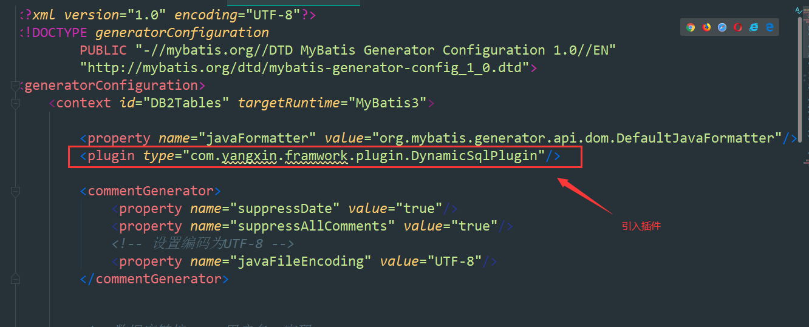
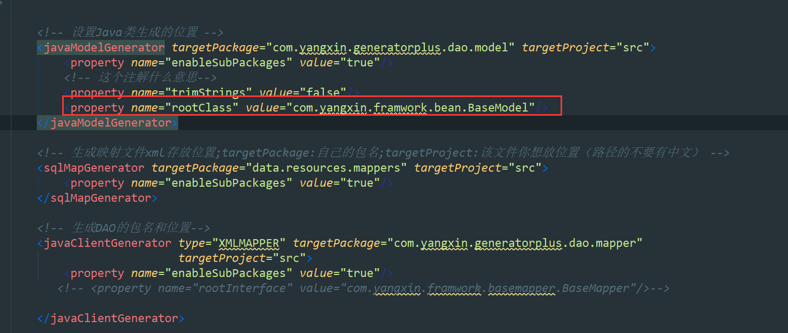

# generator-plus

​	是在mybatis-generator 的基础上添加一个 DynamicSqlPlugin的插件。

DynamicSqlPlugin插件的作用：在生成的Mapper接口和 SQL XML文件，自动生成：

XXXmapper

```java
public interface CourseInfoMapper extends BaseMapper<CourseInfo> {
    int deleteByPrimaryKey(Integer id);

    int insert(CourseInfo record);

    int insertSelective(CourseInfo record);

    CourseInfo selectByPrimaryKey(Integer id);

    int updateByPrimaryKeySelective(CourseInfo record);

    int updateByPrimaryKey(CourseInfo record);


//*****************************一下是插件自动生成的部分*************************
   List<CourseInfo> getByConditions(@Param("conditions") Map<String, Object> conditions);

    List<CourseInfo> getByConditionList(@Param("conditions") List<Condition> conditions);

    List<CourseInfo> getByIn(@Param("set") Set<Object> set, @Param("field") String field);

    List<CourseInfo> getSortedResultByConditionList(@Param("set") List<Condition> set, @Param("sorter") Sort sorter);

    List<CourseInfo> getSortedResultByConditionLists(@Param("set") List<Condition> set, @Param("sorter") List<Sort> sorter);
}
```


XXXmapper.xml


```xml
<?xml version="1.0" encoding="UTF-8"?>
<!DOCTYPE mapper PUBLIC "-//mybatis.org//DTD Mapper 3.0//EN" "http://mybatis.org/dtd/mybatis-3-mapper.dtd">
<mapper namespace="com.yangxin.generatorplus.dao.mapper.CourseInfoMapper">
  <resultMap id="BaseResultMap" type="com.yangxin.generatorplus.dao.model.CourseInfo">
    <id column="id" jdbcType="INTEGER" property="id" />
    <result column="name" jdbcType="VARCHAR" property="name" />
    <result column="teacher_id" jdbcType="INTEGER" property="teacherId" />
    <result column="vehicle_id" jdbcType="INTEGER" property="vehicleId" />
    <result column="optional_number" jdbcType="INTEGER" property="optionalNumber" />
    <result column="course_date_time" jdbcType="VARCHAR" property="courseDaTime" />
    <result column="course_status" jdbcType="SMALLINT" property="courseStatus" />
    <result column="course_type" jdbcType="SMALLINT" property="courseType" />
    <result column="choose_time" jdbcType="TIMESTAMP" property="chooseTime" />
    <result column="place" jdbcType="VARCHAR" property="place" />
    <result column="start_time" jdbcType="TIMESTAMP" property="startTime" />
    <result column="end_time" jdbcType="TIMESTAMP" property="endTime" />
    <result column="create_at" jdbcType="TIMESTAMP" property="createAt" />
    <result column="update_at" jdbcType="TIMESTAMP" property="updateAt" />
    <result column="deleted" jdbcType="SMALLINT" property="deleted" />
  </resultMap>
  <sql id="Base_Column_List">
    id, name, teacher_id, vehicle_id, optional_number, course_date_time, course_status, 
    course_type, choose_time, place, start_time, end_time, create_at, update_at, deleted
  </sql>
  <select id="selectByPrimaryKey" parameterType="java.lang.Integer" resultMap="BaseResultMap">
    select 
    <include refid="Base_Column_List" />
    from course_info
    where id = #{id,jdbcType=INTEGER}
  </select>
  <delete id="deleteByPrimaryKey" parameterType="java.lang.Integer">
    delete from course_info
    where id = #{id,jdbcType=INTEGER}
  </delete>
  <insert id="insert" parameterType="com.yangxin.generatorplus.dao.model.CourseInfo">
    <selectKey keyProperty="id" order="AFTER" resultType="java.lang.Integer">
      SELECT LAST_INSERT_ID()
    </selectKey>
    insert into course_info (name, teacher_id, vehicle_id, 
      optional_number, course_date_time, course_status, 
      course_type, choose_time, place, 
      start_time, end_time, create_at, 
      update_at, deleted)
    values (#{name,jdbcType=VARCHAR}, #{teacherId,jdbcType=INTEGER}, #{vehicleId,jdbcType=INTEGER}, 
      #{optionalNumber,jdbcType=INTEGER}, #{courseDateTime,jdbcType=VARCHAR}, #{courseStatus,jdbcType=SMALLINT}, 
      #{courseType,jdbcType=SMALLINT}, #{chooseTime,jdbcType=TIMESTAMP}, #{place,jdbcType=VARCHAR}, 
      #{startTime,jdbcType=TIMESTAMP}, #{endTime,jdbcType=TIMESTAMP}, #{createAt,jdbcType=TIMESTAMP}, 
      #{updateAt,jdbcType=TIMESTAMP}, #{deleted,jdbcType=SMALLINT})
  </insert>
  <insert id="insertSelective" parameterType="com.yangxin.generatorplus.dao.model.CourseInfo">
    <selectKey keyProperty="id" order="AFTER" resultType="java.lang.Integer">
      SELECT LAST_INSERT_ID()
    </selectKey>
    insert into course_info
    <trim prefix="(" suffix=")" suffixOverrides=",">
      <if test="name != null">
        name,
      </if>
      <if test="teacherId != null">
        teacher_id,
      </if>
      <if test="vehicleId != null">
        vehicle_id,
      </if>
      <if test="optionalNumber != null">
        optional_number,
      </if>
      <if test="courseDateTime != null">
        course_date_time,
      </if>
      <if test="courseStatus != null">
        course_status,
      </if>
      <if test="courseType != null">
        course_type,
      </if>
      <if test="chooseTime != null">
        choose_time,
      </if>
      <if test="place != null">
        place,
      </if>
      <if test="startTime != null">
        start_time,
      </if>
      <if test="endTime != null">
        end_time,
      </if>
      <if test="createAt != null">
        create_at,
      </if>
      <if test="updateAt != null">
        update_at,
      </if>
      <if test="deleted != null">
        deleted,
      </if>
    </trim>
    <trim prefix="values (" suffix=")" suffixOverrides=",">
      <if test="name != null">
        #{name,jdbcType=VARCHAR},
      </if>
      <if test="teacherId != null">
        #{teacherId,jdbcType=INTEGER},
      </if>
      <if test="vehicleId != null">
        #{vehicleId,jdbcType=INTEGER},
      </if>
      <if test="optionalNumber != null">
        #{optionalNumber,jdbcType=INTEGER},
      </if>
      <if test="courseDateTime != null">
        #{courseDateTime,jdbcType=VARCHAR},
      </if>
      <if test="courseStatus != null">
        #{courseStatus,jdbcType=SMALLINT},
      </if>
      <if test="courseType != null">
        #{courseType,jdbcType=SMALLINT},
      </if>
      <if test="chooseTime != null">
        #{chooseTime,jdbcType=TIMESTAMP},
      </if>
      <if test="place != null">
        #{place,jdbcType=VARCHAR},
      </if>
      <if test="startTime != null">
        #{startTime,jdbcType=TIMESTAMP},
      </if>
      <if test="endTime != null">
        #{endTime,jdbcType=TIMESTAMP},
      </if>
      <if test="createAt != null">
        #{createAt,jdbcType=TIMESTAMP},
      </if>
      <if test="updateAt != null">
        #{updateAt,jdbcType=TIMESTAMP},
      </if>
      <if test="deleted != null">
        #{deleted,jdbcType=SMALLINT},
      </if>
    </trim>
  </insert>
  <update id="updateByPrimaryKeySelective" parameterType="com.yangxin.generatorplus.dao.model.CourseInfo">
    update course_info
    <set>
      <if test="name != null">
        name = #{name,jdbcType=VARCHAR},
      </if>
      <if test="teacherId != null">
        teacher_id = #{teacherId,jdbcType=INTEGER},
      </if>
      <if test="vehicleId != null">
        vehicle_id = #{vehicleId,jdbcType=INTEGER},
      </if>
      <if test="optionalNumber != null">
        optional_number = #{optionalNumber,jdbcType=INTEGER},
      </if>
      <if test="courseDateTime != null">
        course_date_time = #{courseDateTime,jdbcType=VARCHAR},
      </if>
      <if test="courseStatus != null">
        course_status = #{courseStatus,jdbcType=SMALLINT},
      </if>
      <if test="courseType != null">
        course_type = #{courseType,jdbcType=SMALLINT},
      </if>
      <if test="chooseTime != null">
        choose_time = #{chooseTime,jdbcType=TIMESTAMP},
      </if>
      <if test="place != null">
        place = #{place,jdbcType=VARCHAR},
      </if>
      <if test="startTime != null">
        start_time = #{startTime,jdbcType=TIMESTAMP},
      </if>
      <if test="endTime != null">
        end_time = #{endTime,jdbcType=TIMESTAMP},
      </if>
      <if test="createAt != null">
        create_at = #{createAt,jdbcType=TIMESTAMP},
      </if>
      <if test="updateAt != null">
        update_at = #{updateAt,jdbcType=TIMESTAMP},
      </if>
      <if test="deleted != null">
        deleted = #{deleted,jdbcType=SMALLINT},
      </if>
    </set>
    where id = #{id,jdbcType=INTEGER}
  </update>
  <update id="updateByPrimaryKey" parameterType="com.yangxin.generatorplus.dao.model.CourseInfo">
    update course_info
    set name = #{name,jdbcType=VARCHAR},
      teacher_id = #{teacherId,jdbcType=INTEGER},
      vehicle_id = #{vehicleId,jdbcType=INTEGER},
      optional_number = #{optionalNumber,jdbcType=INTEGER},
      course_date_time = #{courseDateTime,jdbcType=VARCHAR},
      course_status = #{courseStatus,jdbcType=SMALLINT},
      course_type = #{courseType,jdbcType=SMALLINT},
      choose_time = #{chooseTime,jdbcType=TIMESTAMP},
      place = #{place,jdbcType=VARCHAR},
      start_time = #{startTime,jdbcType=TIMESTAMP},
      end_time = #{endTime,jdbcType=TIMESTAMP},
      create_at = #{createAt,jdbcType=TIMESTAMP},
      update_at = #{updateAt,jdbcType=TIMESTAMP},
      deleted = #{deleted,jdbcType=SMALLINT}
    where id = #{id,jdbcType=INTEGER}
  </update>
    
    <!-- 以下是插件生成的-->
    
    
  <select id="getByConditions" parameterType="map" resultMap="BaseResultMap">
    select 
    <include refid="Base_Column_List" />
    from course_info
    <where>
      <choose>
        <when test="conditions!= null">
          <foreach close="" collection="conditions" index="key" item="value" open="" separator="AND">
             ${key}=#{value}
          </foreach>
        </when>
      </choose>
    </where>
  </select>
  <select id="getByConditionList" parameterType="list" resultMap="BaseResultMap">
    select 
    <include refid="Base_Column_List" />
    from course_info
    <where>
      <choose>
        <when test="conditions != null and conditions.size() > 0">
          <foreach close="" collection="conditions" index="key" item="value" open="" separator="AND">
            <choose>
              <when test="item.opt == 'locate'">
                locate(#{item.value}, ${item.key}) > 0
              </when>
              <when test="item.opt == 'in'">
                 ${item.key} in 
                <foreach close=")" collection="item.value" item="itemIn" open="(" separator=",">
                   #{itemIn}
                </foreach>
              </when>
              <when test="item.opt == 'between'">
                  ${item.key} between 
                <foreach close="" collection="item.value" index="key" item="value" open="" separator="AND">
                   #{value}
                </foreach>
              </when>
              <otherwise>
                 ${item.key} ${item.opt} #{item.value}
              </otherwise>
            </choose>
          </foreach>
        </when>
      </choose>
    </where>
  </select>
  <select id="getByIn" resultMap="BaseResultMap">
    select 
    <include refid="Base_Column_List" />
    from course_info
    <where>
      <choose>
        <when test="field != null">
          ${field} in
          <foreach close=")" collection="set" index="index" item="item" open="(" separator=",">
             #{item}
          </foreach>
        </when>
      </choose>
    </where>
  </select>
  <select id="getSortedResultByConditionLists" resultMap="BaseResultMap">
    select 
    <include refid="Base_Column_List" />
    from course_info
    <where>
      <choose>
        <when test="conditions != null and conditions.size() > 0">
          <foreach close="" collection="conditions" index="key" item="value" open="" separator="AND">
            <choose>
              <when test="item.opt == 'locate'">
                locate(#{item.value}, ${item.key}) > 0
              </when>
              <when test="item.opt == 'in'">
                 ${item.key} in 
                <foreach close=")" collection="item.value" item="itemIn" open="(" separator=",">
                   #{itemIn}
                </foreach>
              </when>
              <when test="item.opt == 'between'">
                  ${item.key} between 
                <foreach close="" collection="item.value" index="key" item="value" open="" separator="AND">
                   #{value}
                </foreach>
              </when>
              <otherwise>
                 ${item.key} ${item.opt} #{item.value}
              </otherwise>
            </choose>
          </foreach>
        </when>
      </choose>
    </where>
    <choose>
      <when test="sorter !=null and sorter.size() > 0">
         order by 
        <foreach close="" collection="sorter" item="item" open="" separator=",">
          ${item.field} ${item.sortType}
        </foreach>
      </when>
    </choose>
  </select>
  <select id="getSortedResultByConditionList" resultMap="BaseResultMap">
    select 
    <include refid="Base_Column_List" />
    from course_info
    <where>
      <choose>
        <when test="conditions != null and conditions.size() > 0">
          <foreach close="" collection="conditions" index="key" item="value" open="" separator="AND">
            <choose>
              <when test="item.opt == 'locate'">
                locate(#{item.value}, ${item.key}) > 0
              </when>
              <when test="item.opt == 'in'">
                 ${item.key} in 
                <foreach close=")" collection="item.value" item="itemIn" open="(" separator=",">
                   #{itemIn}
                </foreach>
              </when>
              <when test="item.opt == 'between'">
                  ${item.key} between 
                <foreach close="" collection="item.value" index="key" item="value" open="" separator="AND">
                   #{value}
                </foreach>
              </when>
              <otherwise>
                 ${item.key} ${item.opt} #{item.value}
              </otherwise>
            </choose>
          </foreach>
        </when>
      </choose>
    </where>
    <choose>
      <when test="sorter !=null">
         order by ${sorter.field} ${sorter.sortType} 
      </when>
    </choose>
  </select>
</mapper>
```


#### 怎么使用：





